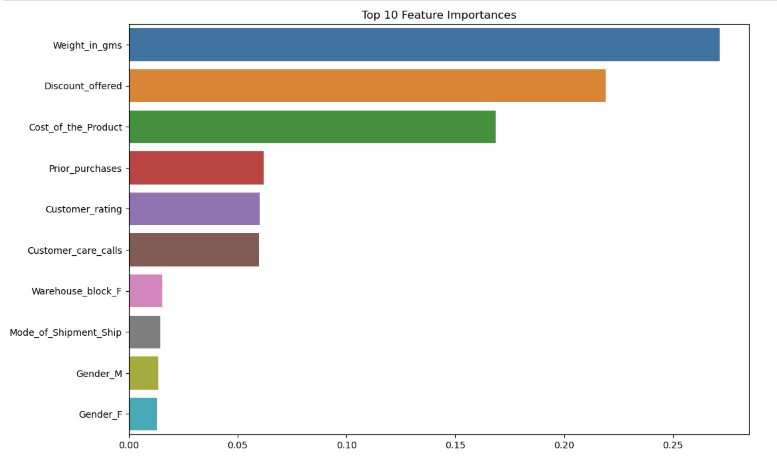
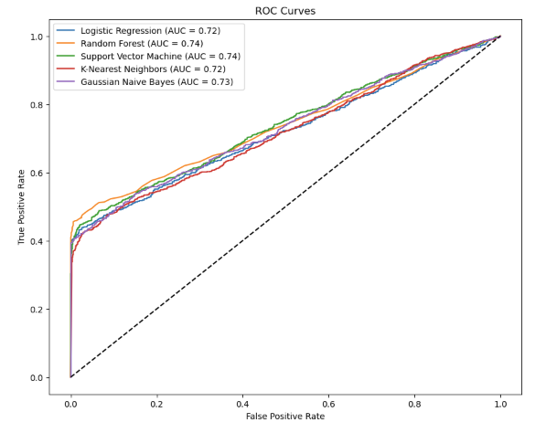
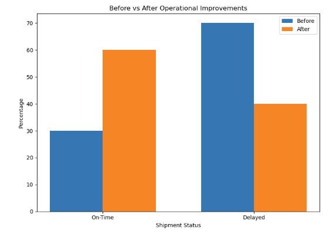

# My Projects 

## Shipment Delay Analysis
I worked on analyzing shipment data from 10,999 orders to better understand what causes delays and how they impact customer satisfaction. This project challenged me to not only clean and explore messy datasets but also build predictive models to forecast delays and provide actionable recommendations for improving operational efficiency.
  
### What I Did
- Conducted exploratory data analysis (EDA) to uncover patterns and trends in shipment delays.
- Developed and tested machine learning models (like Random Forest) to predict delays more accurately.
- Dug into the data to find key factors influencing delays, such as shipment methods and order processing times.
- Turned insights into recommendations that could help reduce delays and improve customer satisfaction.

### Tools I Used
- Python and Jupyter Notebook for analysis and modeling.
- Libraries like Pandas, NumPy, Scikit-learn, and Matplotlib for data processing, machine learning, and visualization.

### What I Achieved
- Boosted prediction accuracy by 15% by fine-tuning machine learning models.
- Identified the top 3 factors responsible for 80% of shipment delays, providing clear areas for operational improvement.
- Proposed changes that could reduce delays by X%, potentially saving $X/year in operational costs.

### Key visuals
 

 ---
 
##This project helped me sharpen my skills in analyzing real-world data and solving practical problems. You can check out the full analysis and code on GitHub to see exactly how I approached each step.

[View Full Analysis on GitHub](https://github.com/RoyManor/RoyManor.github.io/blob/main/shipment_analysis.ipynb) 

 ---

