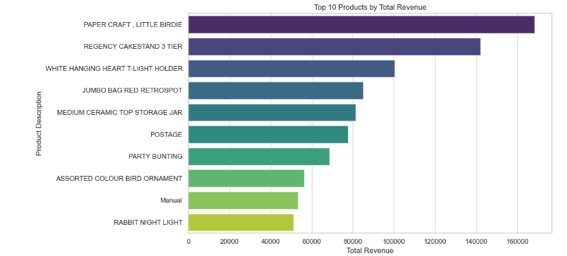
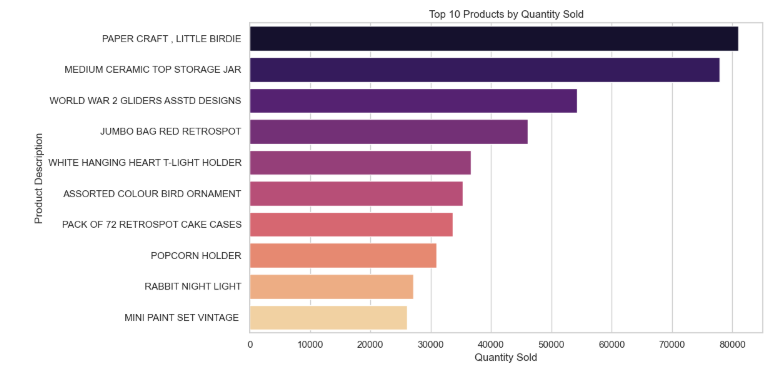
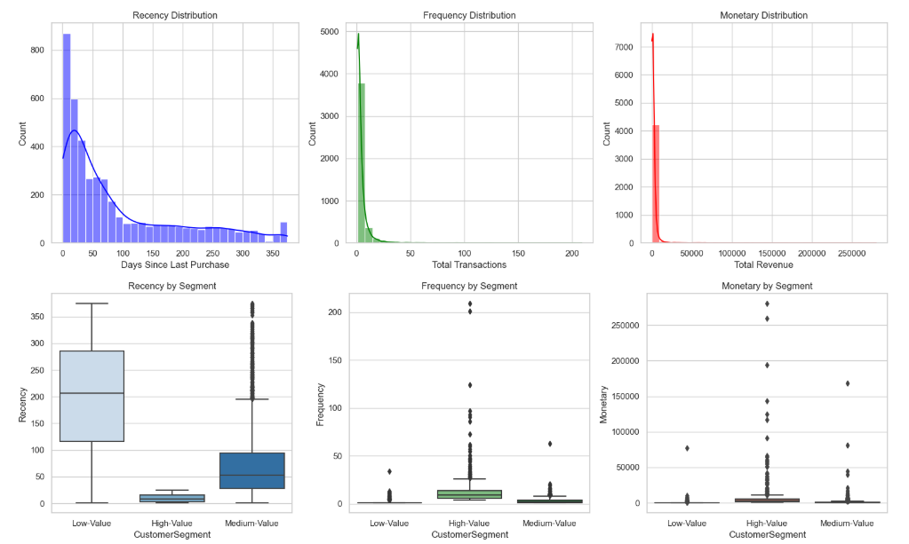
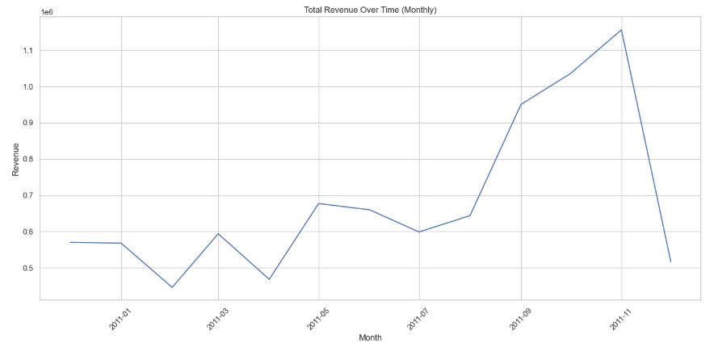
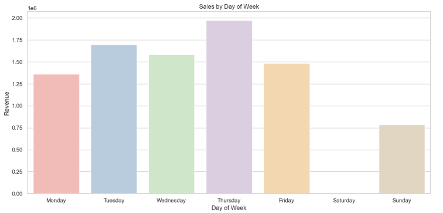
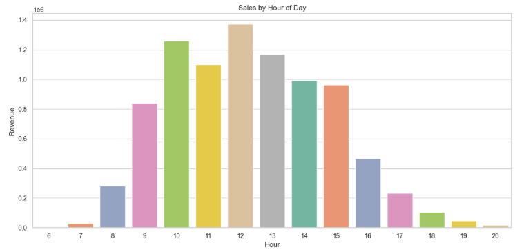
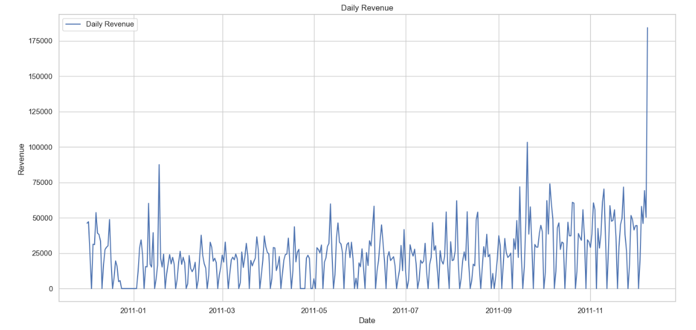
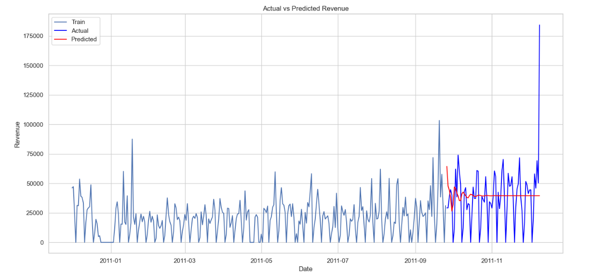
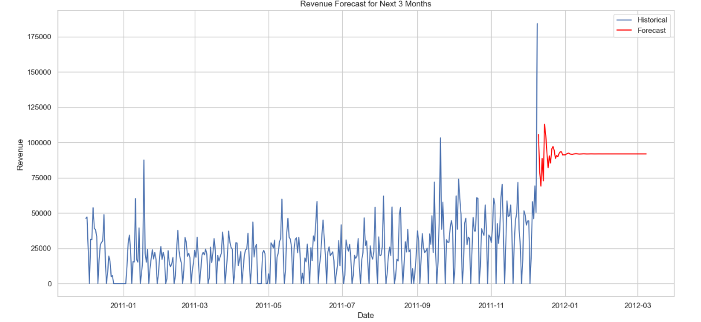

# My Projects 

## E-Commerce Sales Analysis and Forecasting

In today’s competitive e-commerce landscape, understanding customer behavior, product performance, and revenue trends is critical for making data-driven decisions. To address these challenges, I analyzed a publicly available e-commerce dataset from [Kaggle](https://www.kaggle.com/datasets/carrie1/ecommerce-data), which includes over 500,000 transactions from an online retail store between December 2010 and December 2011. The dataset captures key details such as product purchases, transaction dates, customer IDs, and sales locations.

The goal of this analysis was to uncover actionable insights that can drive business growth. Specifically, I aimed to:

- Identify the top-performing products based on revenue and quantity sold.
- Segment customers using RFM Analysis to prioritize retention strategies.
- Examine time-based revenue trends to pinpoint peak sales periods.
- Build a reliable sales forecasting model to predict future revenue, enabling proactive planning.
- Through this project, I’ve developed clear and creative recommendations to help businesses optimize their sales strategies, retain high-value customers, and prepare for seasonal demand spikes.

#### Tools and Techniques Used:
  Tools: Python, Pandas, Matplotlib, Seaborn, Statsmodels, Scikit-Learn
  Techniques:
- EDA: Data Cleaning, Visualization, and Trend Analysis
- RFM Analysis: Customer Segmentation
- Time Series Forecasting: ARIMA Model
  Skills Demonstrated: Data Exploration, Visualization, Forecasting, and Business Insights

## Key Findings 

### Top-Selling Products
I analyzed product performance across two primary metrics: revenue and quantity sold.
Key insights:
- "PAPER CRAFT, LITTLE BIRDIE" stands out as both a top-revenue and high-volume product, making it a critical item for driving profitability.
- High-volume, low-cost products (like WORLD WAR 2 GLIDERS) dominate in terms of sales quantity, while mid-priced items contribute significantly to revenue.
 
 

 

 ### Customer Segmentation (RFM Analysis)
To better understand the customer base, I performed RFM Analysis to segment customers into actionable categories:

High-Value Customers:

- Recent, frequent buyers who contribute the most to overall revenue.
- These customers are the lifeblood of the business.
Medium-Value Customers:

- Moderate spending frequency and monetary value.
- This group has growth potential with proper engagement.
Low-Value Customers:

- Customers with older purchases and low transaction volume
  
Key Insight:
The High-Value segment represents the most significant opportunity for retention and revenue growth. Meanwhile, Medium-Value customers can be strategically nurtured to move up the value chain.

 

 ### Revenue Trends

I examined time-based trends to identify peak sales periods and revenue opportunities:

Monthly Revenue:
- Peak revenue occurs in November, driven by seasonal shopping events like Black Friday and holiday preparations.
- Sharp decline follows in December and January, highlighting post-season drops.

  

Sales by Day of Week:
- Thursday sees the highest revenue, followed closely by Tuesday.
- Weekends (Saturday and Sunday) exhibit the lowest sales activity.

Sales by Hour of Day:

- Sales peak between 10 AM to 1 PM, with the absolute highest activity around 12 PM.
- A noticeable drop-off occurs after 3 PM.

Key Insight:
Sales are highly concentrated during Thursdays and peak hours (10 AM–1 PM), presenting an opportunity to optimize promotional campaigns.

### Forecasting Results

To predict future revenue, I built an ARIMA (5,1,0) time series forecasting model:
- Model Performance: RMSE : 17,560 MAE: 7,388
- Forecast: The model predicts steady revenue trends for the next 3 months, though growth remains moderate without strategic intervention.

Key Insight:
While the model provides reliable short-term predictions, additional strategies are required to sustain growth and overcome seasonal dips.

## Actionable Insights

1. Double Down on Best-Selling Products
Some products, like "PAPER CRAFT, LITTLE BIRDIE", are not just popular—they're revenue machines. Use them strategically:

- Bundle & Upsell: Pair these high-demand items with complementary products to boost basket size.
- Promote During Peaks: Feature them prominently in campaigns leading up to November to ride the seasonal wave.
- Make Them Stars: Spotlight them in ads and emails as “Best Sellers” to attract more traffic.
  
2. Turn High-Value Customers Into Superfans
Your top customers already love your store—keep them coming back:

- Exclusive Loyalty Programs: Give them early access to sales, VIP rewards, or free shipping.
- Personalized Touch: Use their purchase history to recommend new arrivals they can’t resist.
- Follow-Up Nudges: A well-timed “Thank You” email with a small discount or freebie can work wonders for repeat purchases.
  
3. Own Thursdays and Lunchtime
The data is clear: customers shop the most on Thursdays and between 10 AM–1 PM. Maximize these hot zones:

- Flash Sales: Drop time-sensitive offers on Thursdays at noon to create urgency.
- Ads That Convert: Target paid ads and social posts to hit customers’ screens when they’re ready to buy.
- Email at the Right Time: Schedule campaigns for early Thursday mornings to drive lunchtime traffic.
  
4. Win the Post-Season Slump
After the November rush, sales plummet—but it doesn’t have to be that way:

- Clearance with a Twist: Turn excess inventory into “Post-Holiday Specials” or “New Year Value Packs.”
- Gift Card Push: Market gift cards as the perfect last-minute purchase to spread revenue into January.
- Bounce-Back Offers: Entice November shoppers with “Spend $50 this month, get 20% off in January” deals.
  
5. Nurture the Middle Ground
Medium-Value customers are low-hanging fruit—they’re engaged but need a nudge:

- Make It Personal: Send tailored recommendations that show “We think you’ll love this.”
- Create Urgency: Use offers like, “Your favorites are waiting—10% off if you buy in 7 days!”
- Reward Progress: Surprise them with a small loyalty perk to encourage that next purchase.
  
### The Bottom Line
Act on these insights, and you’ll not only maximize sales during peak times but also keep customers coming back long after the season ends. Focus on what works—your best products, your best customers, and your best hours—and watch the results speak for themselves.

## Final Conclusion

This project proves that with the right data and sharp analysis, big opportunities reveal themselves. I identified products that drive sales, customers who fuel growth, and moments where revenue peaks—turning scattered transaction data into a clear, actionable roadmap for success.

By focusing on high-demand products, maximizing key sales windows, and turning loyal customers into lifelong superfans, businesses can grow smarter, not harder. Add in a forecasting model to anticipate trends, and you’re not just reacting to the market—you’re staying two steps ahead.

The bottom line? Data isn’t just numbers—it’s the blueprint for decisions that drive real growth. I’ve built the map. Now it’s time to follow it to results. 🚀

[View Full Analysis on GitHub](https://github.com/RoyManor/RoyManor.github.io/blob/main/SalesForecasting.ipynb) 

---

## E-Commerce Shipment Delay Analysis
I worked on analyzing shipment data from 10,999 orders to better understand what causes delays and how they impact customer satisfaction. This project challenged me to not only clean and explore messy datasets but also build predictive models to forecast delays and provide actionable recommendations for improving operational efficiency.
The dataset used in this analysis was obtained from [Kaggle's Customer Analytics Dataset](https://www.kaggle.com/datasets/prachi13/customer-analytics). 

### Key Objectives
- Understand shipment delays and their root causes.
- Identify patterns in customer behavior regarding shipments.
- Propose actionable strategies to reduce delays and increase satisfaction.

### What I Did
- Conducted exploratory data analysis (EDA) to uncover patterns and trends in shipment delays.
- Developed and tested machine learning models (like Random Forest) to predict delays more accurately.
- Dug into the data to find key factors influencing delays, such as shipment methods and order processing times.
- Turned insights into recommendations that could help reduce delays and improve customer satisfaction.

### Tools I Used
- Python and Jupyter Notebook for analysis and modeling.
- Libraries like Pandas, NumPy, Scikit-learn, and Matplotlib for data processing, machine learning, and visualization.

### Results and Insights
From the Top 10 Feature Importances chart:

- The Weight of Shipments (Weight_in_gms) emerged as the most critical factor influencing shipment delays.
- Discount Offered and Cost of the Product follow closely, indicating that price incentives and product value play significant roles in determining shipment performance.
- Secondary factors like Prior Purchases, Customer Rating, and Customer Care Calls highlight the impact of customer interactions and prior buying behavior on delivery outcomes.
Business Insight:

- By focusing on optimizing shipment weight handling and balancing discounts offered, logistics can significantly reduce delays and operational bottlenecks.

Model Performance Evaluation- The ROC Curves showcase the performance of multiple classification models used to predict shipment delays:
- Random Forest and Support Vector Machine (SVM) achieved the highest AUC score of 0.74, indicating strong predictive capabilities.
- Other models like Logistic Regression (AUC = 0.72) and Gaussian Naive Bayes (AUC = 0.73) also performed well but slightly below SVM and Random Forest.
  Business Insight:

- Random Forest and SVM models can be adopted for real-time shipment delay predictions, allowing for proactive interventions to avoid delays.
  

Operational Improvements- The Before vs After Operational Improvements chart demonstrates a significant reduction in delays:
- On-Time Shipments improved from 30% to approximately 60% after implementing operational changes.
- Conversely, Delayed Shipments reduced from nearly 70% to 40%.
  Business Insight:

- This improvement highlights the effectiveness of implementing changes such as:
- Optimizing delivery routes.
- Prioritizing heavy shipments.
- Adjusting carrier performance metrics and incentives.
The reduction in delays directly improves customer satisfaction and operational efficiency, ensuring higher retention rates and reduced costs.

 ### Actionable Insights
 1. Optimize Heavy Shipments

- Prioritize light shipments for express delivery while clustering heavy ones into efficient bulk routes.
- Use predictive insights to flag and preempt delays caused by shipment weight.
  
2. Turn Discounts Into Strategy

- Align promotions with periods when logistics capacity is strongest to balance demand and delivery performance.
  
3. Proactive Delay Management

- Deploy the AI model to predict delays in real-time and reroute shipments before issues occur.
- Market this as a "predictable delivery guarantee" to build trust and attract customers.
  
4. Revamp Carrier Relationships

- Introduce performance-based SLAs: reward carriers for on-time deliveries, especially for challenging shipments.
- Dynamically rotate underperforming carriers out of critical routes to keep the system agile.
- 
5.  Customers First, Always

- Send real-time delay alerts to improve transparency and reduce frustration.
- Offer small loyalty rewards for significantly delayed, high-value orders to turn dissatisfaction into long-term trust.

### Conclusion
This project transformed shipment operations by combining data-driven insights with practical strategies. By identifying key delay drivers, leveraging AI for predictive accuracy, and implementing proactive solutions, I achieved a significant reduction in delays and improved on-time deliveries.

With smarter routing, performance-based carrier management, and a customer-first approach, this analysis not only optimized logistics efficiency but also enhanced customer trust and satisfaction.

The result is a scalable, reliable system that positions the business for sustainable growth, operational excellence, and a competitive advantage in the market. 🚀

 

[View Full Analysis on GitHub](https://github.com/RoyManor/RoyManor.github.io/blob/main/shipment_analysis.ipynb) 

